# Azure DevOps Pipeline Project Setup Example

This is an operator manual for setting up a MAPPO project where:

- Azure DevOps tells MAPPO when a release is ready.
- MAPPO later starts a different Azure DevOps deployment pipeline.
- The deployment pipeline deploys one selected target at a time.
- Targets are imported into MAPPO from infrastructure inventory.

The important distinction is that there are two Azure DevOps pipeline roles:

1. **Release-readiness pipeline**: runs after a release change lands on `main` and notifies MAPPO that a release exists.
2. **Deployment pipeline**: started by MAPPO during a deployment run. This pipeline owns its Azure credentials/service connections and deploys to the target MAPPO passes in.

MAPPO does not own the deployment pipeline's Azure service connection. MAPPO only calls Azure DevOps to start the selected pipeline with target and release parameters.

## Example Topology

```mermaid
flowchart LR
    A[Developer merges release PR to main] --> B[Azure DevOps release-readiness pipeline]
    B --> C[Azure DevOps service hook]
    C --> D[MAPPO Release Source]
    D --> E[MAPPO release catalog]
    E --> F[Operator starts deployment]
    F --> G[MAPPO Deployment Connection]
    G --> H[Azure DevOps deployment pipeline]
    H --> I[Selected target App Service]
```



## Prerequisites

You need:

- a running MAPPO backend and frontend
- MAPPO API base URL, for example `https://api.mappopoc.com`
- MAPPO Key Vault name
- an Azure DevOps organization and project
- an Azure DevOps repo containing both pipeline YAML files
- an Azure DevOps PAT that can read projects/repos/pipelines and queue pipeline runs
- an Azure DevOps webhook/shared secret for release event verification
- one or more deployable targets provisioned outside MAPPO

For the current demo repo, the workload repo is:

```text
/Users/cvonderheid/workspace/demo-app-service
```

It contains:

- `azure-pipelines.release.yml`: release-readiness pipeline
- `azure-pipelines.yml`: deployment pipeline started by MAPPO
- `app/release.json`: release metadata changed by the demo release PR

## 1. Create Secrets In MAPPO Key Vault

Create one secret for the Azure DevOps PAT and one secret for the Azure DevOps webhook verification value.

```bash
az keyvault secret set \
  --vault-name "$MAPPO_KEY_VAULT_NAME" \
  --name "ado-personal-access-token" \
  --value "<azure-devops-pat>"

az keyvault secret set \
  --vault-name "$MAPPO_KEY_VAULT_NAME" \
  --name "ado-release-webhook-secret" \
  --value "<shared-webhook-secret>"
```

The secret names are operator-facing names. MAPPO stores only references to these names; the real values remain server-side in Key Vault.

## 2. Create Secret References In MAPPO

Open **Admin -> Secret Inventory**.

Create the Azure DevOps PAT reference:

- **Display name**: `Azure DevOps Runtime PAT`
- **Provider**: `Azure DevOps`
- **Usage**: `Deployment API credential`
- **Secret storage**: `Use Azure Key Vault secret`
- **Azure Key Vault secret name**: `ado-personal-access-token`

Create the Azure DevOps webhook reference:

- **Display name**: `Azure DevOps Release Webhook Secret`
- **Provider**: `Azure DevOps`
- **Usage**: `Webhook verification`
- **Secret storage**: `Use Azure Key Vault secret`
- **Azure Key Vault secret name**: `ado-release-webhook-secret`

## 3. Create The Release Source

Open **Admin -> Release Sources** and create a new release source.

Use:

- **Release provider**: `Azure DevOps`
- **Webhook verification**: select the named webhook secret reference from Step 2
- **Optional branch filter**: `main`, if releases should only come from `main`
- **Optional pipeline ID filter**: the release-readiness pipeline ID, if this source should only accept events from that pipeline

Copy the generated webhook URL. It should look like this:

```text
https://<mappo-api-host>/api/v1/release-ingest/endpoints/<release-source-id>/webhooks/ado
```

Use the endpoint-scoped URL. Do not use older `/api/v1/admin/releases/webhooks/...` URLs.

## 4. Configure The Azure DevOps Release-Readiness Pipeline

In Azure DevOps, create a pipeline from `azure-pipelines.release.yml`.

The current demo release-readiness pipeline:

- triggers on `main`
- only watches `app/release.json`
- reads the release version from `app/release.json`
- marks the ADO pipeline run/build number with that version
- emits the pipeline event MAPPO uses to register a release

Create an Azure DevOps service hook for this pipeline:

- **Publisher**: Azure Pipelines
- **Event**: run state changed / completed
- **Pipeline**: the release-readiness pipeline
- **Consumer**: Web Hooks
- **URL**: the MAPPO Release Source webhook URL from Step 3
- **Secret/token**: the same value stored in `ado-release-webhook-secret`

The MAPPO Azure DevOps Release Source must also filter to the same
release-readiness pipeline ID. If this filter is blank or points at the
deployment pipeline instead, MAPPO receives the webhook but records it as skipped
with a message like `Ignored Azure DevOps webhook for non-configured pipeline 2`.

For the demo scripts, this can be automated after the release-readiness pipeline exists:

```bash
./scripts/ado_release_webhook_bootstrap.sh \
  --organization <ado-organization-url> \
  --project <ado-project-name> \
  --pipeline-id <release-readiness-pipeline-id> \
  --replace-existing
```

The service hook is inbound release notification plumbing. It does not deploy anything.

## 5. Create The Deployment Connection

Open **Admin -> Deployment Connections** and create a new deployment connection.

Use:

- **Deployment system**: `Azure DevOps`
- **Azure DevOps account scope**: paste any project or repository URL from the Azure DevOps account MAPPO should browse
- **Azure DevOps API credential**: select the named PAT secret reference from Step 2

Save and verify the connection.

Expected result:

- MAPPO authenticates to Azure DevOps with the PAT.
- MAPPO derives the Azure DevOps account from the URL.
- MAPPO discovers Azure DevOps projects that this PAT can read.

This connection is only for MAPPO-to-Azure DevOps API calls, such as discovering projects/repos/pipelines and starting the deployment pipeline.

## 6. Configure The MAPPO Project

Create a MAPPO project, then open **Project -> Config**.

Configure the project flow:

1. **Release Source**: choose the Azure DevOps Release Source from Step 3.
2. **Deployment**: choose the Azure DevOps pipeline-driven deployment method.
3. **Deployment Connection**: choose the verified Azure DevOps Deployment Connection from Step 5.
4. **Azure DevOps project**: choose the Azure DevOps project discovered from the connection.
5. **Repository**: choose the repo that contains the deployment pipeline YAML.
6. **Pipeline**: choose the deployment pipeline, not the release-readiness pipeline.
7. **Branch**: choose the branch MAPPO should use when starting the deployment pipeline, normally `main`.
8. **Runtime Health**: configure the HTTP path MAPPO should check after deployment, for example `/health`.

Save and validate the project.

Important: the selected deployment pipeline must already be valid in Azure DevOps. If the pipeline uses an Azure service connection, that service connection is configured in Azure DevOps, not in MAPPO.

## 7. Configure The Azure DevOps Deployment Pipeline

In Azure DevOps, create a separate pipeline from `azure-pipelines.yml`.

This pipeline should usually have:

```yaml
trigger: none
pr: none
```

MAPPO starts it explicitly during deployment. It should not start automatically on every commit.

The pipeline must accept the target/release parameters MAPPO sends. The current demo deployment pipeline accepts parameters such as:

- `targetSubscriptionId`
- `targetResourceGroup`
- `targetAppName`
- `targetId`
- `appVersion`
- `dataModelVersion`
- `mappoProjectId`
- `mappoTargetId`
- `mappoReleaseId`
- `mappoReleaseVersion`

The pipeline owns Azure deployment details. For example, if it uses `AzureCLI@2`, its `azureSubscription` value must reference a valid Azure DevOps service connection:

```yaml
- task: AzureCLI@2
  inputs:
    azureSubscription: <azure-devops-service-connection-name>
```

That service connection must exist and be authorized in Azure DevOps before MAPPO can successfully start deployments.

## 8. Register Or Import Targets

A target is one deployment destination that MAPPO can roll out to. For the pipeline path, a target usually represents one App Service instance plus the metadata the deployment pipeline needs.

For the current demo, targets are created with Pulumi under:

```text
infra/demo/targets-pipeline-delivery
```

Configure the target stack:

```bash
./scripts/targets_pipeline_delivery_configure.sh \
  --stack targets-pipeline-delivery \
  --first-subscription-id <subscription-id-1> \
  --second-subscription-id <subscription-id-2> \
  --location <azure-region>
```

Provision App Service targets, deploy the baseline package, and import the targets into MAPPO:

```bash
./scripts/targets_pipeline_delivery_up.sh \
  --stack targets-pipeline-delivery \
  --api-base-url "$MAPPO_API_BASE_URL"
```

The import writes target records into MAPPO using Pulumi inventory. The target records include the execution metadata MAPPO passes to the deployment pipeline, such as subscription ID, resource group, App Service name, and health URL.

To remove demo targets later:

```bash
./scripts/targets_pipeline_delivery_down.sh \
  --stack targets-pipeline-delivery \
  --api-base-url "$MAPPO_API_BASE_URL"
```

## 9. Create A Demo Release

For the current demo repo, create and merge a release PR from the workload repo:

```bash
cd /Users/cvonderheid/workspace/demo-app-service
./scripts/create_demo_release_pr.sh
```

The script infers Azure DevOps organization, project, and repository from the
workload repo's `origin` remote. Pass `--version <new-version>` only when you
need a specific version instead of the timestamp default.

The script requires an Azure DevOps PAT with branch and pull-request access. Put
it in the workload repo's uncommitted `.data/ado.env` file or export it before
running the script:

```bash
export AZURE_DEVOPS_EXT_PAT="<ado-pat>"
```

That script:

1. creates a release branch
2. updates `app/release.json`
3. opens a PR to `main`
4. completes the PR by default
5. lets Azure DevOps run the release-readiness pipeline
6. lets the service hook notify MAPPO

MAPPO does not create the release. The workload repo emits the release-ready
signal; MAPPO receives it through the configured release source.

After the service hook fires, open **Project -> Releases** in MAPPO and confirm the new release appears.

Troubleshooting:

- `create-demo-release-pr: --ado-pat or AZURE_DEVOPS_EXT_PAT is required.` means the workload repo is missing `.data/ado.env` and no PAT is exported.
- `Ignored Azure DevOps webhook for non-configured pipeline <id>.` means the MAPPO Release Source pipeline filter does not match the release-readiness pipeline ID.

## 10. Start A Deployment

Open **Project -> Deployments**.

1. Click **New Deployment**.
2. Select the release.
3. Select one or more targets.
4. Preview if available.
5. Start the deployment.

MAPPO will start the configured Azure DevOps deployment pipeline once per selected target. Each pipeline run receives target-specific parameters.

## Troubleshooting

### Release does not appear in MAPPO

Check:

- the release-readiness pipeline completed successfully
- the Azure DevOps service hook points to the endpoint-scoped MAPPO URL
- the service hook secret matches the MAPPO release source secret reference
- the MAPPO Release Source provider is `Azure DevOps`
- branch and pipeline ID filters match the actual event

### MAPPO cannot discover Azure DevOps projects

Check:

- the Deployment Connection PAT secret exists in Key Vault
- the Secret Inventory reference points to the correct Key Vault secret name
- the PAT has permission to read Azure DevOps projects/repos/pipelines
- the account scope URL points to the intended Azure DevOps account

### MAPPO starts a deployment but Azure DevOps rejects the run

Check:

- the selected deployment pipeline exists and is authorized
- the selected branch exists
- required YAML parameters match what MAPPO sends
- the pipeline's Azure service connection exists and is authorized
- the service connection has permission to deploy to the target subscription/resource group

### Deployment pipeline starts but target deployment fails

Check:

- the target record has the right subscription ID, resource group, and App Service name
- the Azure DevOps service connection can access that subscription/resource group
- the App Service exists
- the pipeline can deploy the app package manually outside MAPPO
- the runtime health path returns the expected status after deployment
