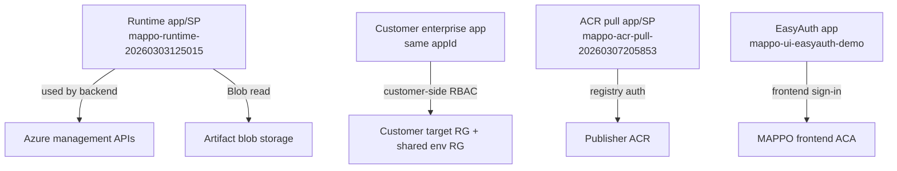

# MAPPO Azure Demo Topology

Date: 2026-03-08
Status: current hosted demo

This document describes the live Azure demo as it exists now.

Important boundary:
- The current demo does **not** use live `Microsoft.Solutions/applications` managed application instances.
- The current demo does **not** use Template Specs.
- The current demo **does** use:
  - MAPPO runtime in Azure Container Apps,
  - a marketplace-event forwarder in Azure Functions,
  - a two-target fleet across two subscriptions/tenants,
  - simulated Marketplace lifecycle events,
  - Deployment Stacks,
  - Blob-hosted deployment artifacts,
  - publisher ACR-hosted workload images.

## Resource Groups By Subscription

### Provider subscription `c0d51042-7d0a-41f7-b270-151e4c4ea263`

| Resource group | Created by | Purpose | Active resources |
|---|---|---|---|
| `rg-mappo-runtime-demo` | `./scripts/runtime_aca_deploy.sh` | Hosted MAPPO runtime | ACA environment, backend ACA, frontend ACA, DB migration job, publisher/runtime ACR, Log Analytics |
| `rg-mappo-marketplace-forwarder-demo` | `./scripts/marketplace_forwarder_deploy.sh` | Marketplace event ingress | Function App, storage account, hosting plan, App Insights |
| `rg-mappo-control-plane-c0d51042` | `infra/pulumi` | Control-plane data services | Azure Database for PostgreSQL Flexible Server |
| `rg-mappo-demo-target-demo-target-01` | `infra/demo-fleet` | Demo target 01 workload | Deployment Stack, target Container App |

### Customer subscription `1adaaa48-139a-477b-a8c8-0e6289d6d199`

| Resource group | Created by | Purpose | Active resources |
|---|---|---|---|
| `rg-mappo-demo-fleet-demo-fleet-1adaaa48` | `infra/demo-fleet` | Shared customer fleet infra | ACA environment, Log Analytics |
| `rg-mappo-demo-target-demo-target-02` | `infra/demo-fleet` | Demo target 02 workload | Deployment Stack, target Container App |

## Creation Boundary

### Pulumi-created
- Control-plane Postgres in `rg-mappo-control-plane-c0d51042`
- Demo target RGs
- Demo customer shared ACA environment RG
- Target Container Apps and Deployment Stack scaffolding in the demo fleet

### Script-created
- MAPPO runtime ACA resources in `rg-mappo-runtime-demo`
- Marketplace forwarder Function App resources in `rg-mappo-marketplace-forwarder-demo`
- Entra app registrations and service principals
- EasyAuth configuration on the frontend ACA
- GitHub webhook bootstrap wiring

### GitHub / managed-app repo
- Release manifest source of truth: `https://github.com/cvonderheid/mappo-managed-app`
- Workload release artifacts are published from that repo to:
  - Blob for deployment templates
  - publisher ACR for workload images

## Topology

```mermaid
flowchart LR
  subgraph GitHub["GitHub"]
    Repo["\"cvonderheid/mappo-managed-app\"\nmanifest + release scripts"]
  end

  subgraph Provider["Provider subscription c0d51042-..."]
    subgraph ControlPlane["rg-mappo-control-plane-c0d51042\n(Pulumi)"]
      Pg["Postgres\npg-mappo-c0d51042"]
    end

    subgraph Runtime["rg-mappo-runtime-demo\n(script)"]
      RuntimeEnv["ACA environment\ncae-mappo-runtime-demo"]
      Api["ACA backend\nca-mappo-api-demo"]
      Ui["ACA frontend\nca-mappo-ui-demo"]
      Job["ACA job\njob-mappo-db-demo"]
      RuntimeAcr["Publisher/runtime ACR\nacrmappodemoc0d51042"]
      RuntimeLaw["Log Analytics"]
    end

    subgraph Forwarder["rg-mappo-marketplace-forwarder-demo\n(script)"]
      Func["Function App\nfa-mappo-forwarder-demo-c0d51042"]
      ArtifactBlob["Blob storage\nstfamappoforwarderdemoc0"]
      ForwarderAi["App Insights + plan"]
    end

    subgraph Target01["rg-mappo-demo-target-demo-target-01\n(Pulumi demo-fleet)"]
      Stack01["Deployment Stack\nmappo-stack-demo-target-01"]
      App01["Target Container App"]
    end
  end

  subgraph Customer["Customer subscription 1adaaa48-..."]
    subgraph Shared["rg-mappo-demo-fleet-demo-fleet-1adaaa48\n(Pulumi demo-fleet)"]
      SharedEnv["ACA environment\ncae-mappo-demo-fleet-demo-fleet"]
      SharedLaw["Log Analytics"]
    end

    subgraph Target02["rg-mappo-demo-target-demo-target-02\n(Pulumi demo-fleet)"]
      Stack02["Deployment Stack\nmappo-stack-demo-target-02"]
      App02["Target Container App"]
    end
  end

  Repo -->|"publish_release.mjs\npublishes template artifact"| ArtifactBlob
  Repo -->|"publish_release.mjs\npublishes workload image"| RuntimeAcr
  Repo -.->|"GitHub webhook"| Api

  Func -.->|"simulated marketplace events"| Api
  Api -->|"reads release manifest from GitHub"| Repo
  Api -->|"reads Blob artifact"| ArtifactBlob
  Api -->|"updates stack"| Stack01
  Api -->|"updates stack"| Stack02

  Stack01 --> App01
  Stack02 --> App02
  App01 -->|"pulls workload image"| RuntimeAcr
  App02 -->|"pulls workload image"| RuntimeAcr
```

## Entra Identities

| Identity | Created by | Used by | Purpose |
|---|---|---|---|
| `mappo-runtime-20260303125015` | `./scripts/azure_auth_bootstrap.sh` | MAPPO backend | Azure control-plane access from the provider tenant |
| Customer-tenant enterprise app for `mappo-runtime-20260303125015` | onboarding scripts | MAPPO backend targeting the customer subscription | Cross-tenant RBAC in the customer subscription |
| `mappo-acr-pull-20260307205853` | `./scripts/azure_acr_pull_bootstrap.sh` | Target Container Apps | Pull workload images from the publisher ACR |
| `mappo-ui-easyauth-demo` | `./scripts/runtime_easyauth_configure.sh` | Frontend ACA | EasyAuth sign-in |

## Identity Usage



## What MAPPO Actually Pushes

### From this repo
- Backend image
- Frontend image
- DB migration job image
- Forwarder deployment package
- Deployment Stack updates into target resource groups

### From `mappo-managed-app`
- Blob-hosted deployment template artifacts
- Publisher ACR workload images
- GitHub-hosted release manifest metadata

## Current Demo Truths

- The provider target reuses the provider ACA environment in `rg-mappo-runtime-demo`.
- The customer target uses its own shared ACA environment in `rg-mappo-demo-fleet-demo-fleet-1adaaa48`.
- Simulated Marketplace events register targets in MAPPO.
- Target metadata may still carry optional `managedApplicationId` fields in the API contract for future real Marketplace use, but the current hosted demo does not depend on them.

## Deprecated Resources Removed

Removed from the live demo environment on 2026-03-08:
- Provider-side Template Specs from `rg-mappo-control-plane-c0d51042`
- Customer legacy control-plane resource group `rg-mappo-control-plane-c0d51042`

## Optional Remaining Cleanup

These Entra objects appear to be stale from older demo iterations and are not part of the current topology:
- `mappo-runtime-20260227192823`
- `mappo-runtime-20260227193604`
